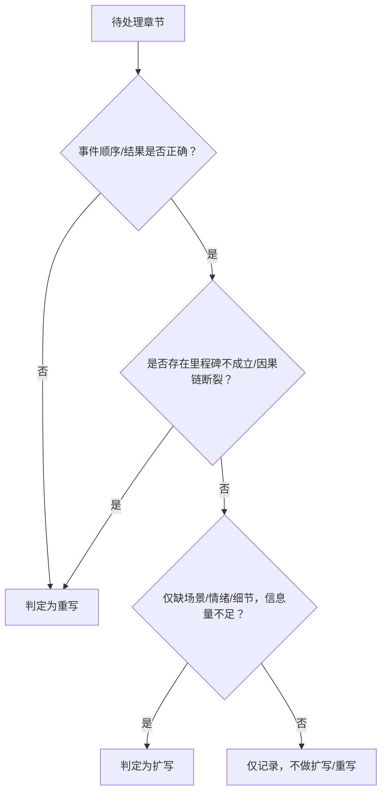

# 《星陨纪元》修订与质量提升 · 专家方案
## 1. 结论摘要（10 条以内要点）
1. 优先级排序：清零 Hard 风险 > 三卷阅读体验统一 > 保留第一卷现有密度，工期适配核心目标分阶段推进。
2. 北极星指标：以「Hard 风险清零 + 单章有效字数区间」为主，卷内节拍密度为辅，按 7:2:1 权重混合驱动。
3. 二/三卷策略：以分阶段扩展为主、局部重写为辅，明确扩写/重写判定标准。
4. 第一卷处理：仅对超长章做删水压缩，禁止触碰核心冲突与因果链，维持主体密度。
5. 最小角色配置：主编、设定监理、扩写执行、统稿、终稿评审，核心环节人机协同+人审兜底。
6. 分阶段路线图：基线评审→P0 修复→扩写试点→规模化扩写/重写→全书统稿，总工期 4.5 个月。
7. 质量门禁：Hard 一票否决，Soft 均分≥3.5 且无两项≤2，扩写后必做回归测试。
8. 版本管控：每批次修订后归档，关键节点做全量回归，避免问题复发。
9. 受众适配：默认按网文平台连载读者设计，预留出版改编的节奏调整接口。
10. 核心风险：扩写注水、里程碑偏移、工期延期，对应缓释措施聚焦质检、设定锚定、分阶段验收。

## 2. 战略取舍与北极星指标
### 2.1 优先级排序与取舍
- **核心优先级**：Hard 风险清零（P0 里程碑、主角唯一性等）> 三卷阅读体验统一 > 保留第一卷现有密度。
- **二选一取舍**：若仅能保两项，放弃「保留第一卷现有密度」。
  - 补偿策略：第一卷仅对 >4500 字且信息重复率高的超长章做「删水型压缩」（删除重复描写、无效寒暄，保留核心冲突/因果链/伏笔）；压缩比例控制在 10% 以内，且压缩后单章仍不低于 2000 字，避免破坏第一卷原有叙事节奏，同时缩小与二/三卷的体验差距。

### 2.2 北极星指标设计
- **主指标（70% 权重）**：「Hard 约束 100% 通过 + 单章有效字数落入 2000–3500 字区间」。
  - Hard 约束：仅判定通过/不通过，无分数；字数统计口径固定为「正文汉字 + 全角标点」，排除标题、空行、分隔符。
- **辅指标 1（20% 权重）**：卷内节拍/冲突密度，按「每 500 字至少 1 个有效冲突/决策点」核算，避免扩写后信息稀释。
- **辅指标 2（10% 权重）**：Soft 指标（S1–S5）均分≥3.5，无两项及以上≤2。
- **混合规则**：每批次迭代先验证 Hard 约束，再核对字数区间，最后评估节拍密度与 Soft 分数；任一主指标不达标，本批次需回退修订，辅指标不达标则列入优化清单，限期整改。

## 3. 战术路径（扩写 / 重写 / 混合的判定树）
### 3.1 判定核心逻辑

### 3.2 第二、三卷具体策略
- **扩写适用场景**：
  1. 章节骨架（目标-障碍-结果）完整，仅因压缩导致场景单薄、心理描写不足、对话简略；
  2. 字数 <1500 字且节拍密度低于「500 字 1 个冲突点」；
  3. 卷间衔接章节（如 ch120→121、ch240→241）仅需补充过渡细节，无需调整核心事件。
  扩写执行：严格按《章节扩展标准操作手册》，从环境/心理/对话/动作/背景五类中按需补充，禁止注水（如纯景物堆砌、重复情绪、说明书式设定）。
- **重写适用场景**：
  1. 修炼里程碑与 `review_prompt.md`/`境界进度追踪.md` 冲突，且无法通过扩写修正；
  2. 因果链断裂（如人物动机无逻辑、事件结果无铺垫）；
  3. 卷间关键衔接（如 ch244 时间跳跃）突兀，扩写无法弥补叙事断层；
  4. 触碰「代际主角/接班人」等 Hard 禁忌，且现有内容无法通过删改规避。
  重写执行：先修订骨架（明确符合 Hard 约束的事件顺序/结果），再按扩写规则补充细节，重写后需同步更新 `docs/` 下对应追踪表。

### 3.3 第一卷具体策略
- **触发条件**：
  1. 字数 >4500 字 + 评审认定「重复信息占比 ≥20%」（如同一信息多次交代、无意义的动作拆分）→ 启动删水压缩；
  2. 字数 2000–4500 字 → 维持现状，仅核查 Hard 约束，不做扩/压；
  3. 存在 Hard 违规 → 仅修正违规内容，不调整篇幅。
- **操作规则**：
  1. 删水仅删除「重复描写、同义反复、无效寒暄、可合并的动作拆分」；
  2. 禁止删除「唯一因果链、里程碑相关对白、伏笔锚点」；
  3. 压缩后单章字数不得 <2000 字，且需保证 S1（剧情完整性）、S2（逻辑自洽）分数不下降。

## 4. 分阶段路线图（阶段名 | 目标 | 输入 | 输出 | 验收 | 人天区间）
| 阶段名 | 目标 | 输入 | 输出 | 验收标准 | 人天区间 |
|--------|------|------|------|----------|----------|
| 基线评审 | 完成全360章Hard/Soft评估，标注扩写/重写范围 | 1. 全卷MD文档；2. review_prompt.md；3. 方法论v0.2；4. docs/追踪表 | 1. 全章评审报告（Hard通过/不通过+Soft分数+证据）；2. 扩写/重写清单（标注P0/P1/P2/P3）；3. 第一卷超长章删水清单 | 1. 评审覆盖率100%；2. 扩写/重写判定符合方法论§6；3. 清单落至具体章节号 | 15–20人天 |
| P0修复 | 清零P0级Hard风险（里程碑、主角唯一性、卷间关键衔接） | 1. 基线评审报告；2. P0章节源文件；3. docs/核心设定表 | 1. P0章节修订版；2. 修复记录（HISTORY.md更新）；3. 回归测试报告 | 1. P0章节Hard全通过；2. 无新增Soft≤2项；3. 设定追踪表同步更新 | 20–25人天 |
| 扩写试点 | 验证扩写SOP有效性，确定批量扩写模板 | 1. P0修复后章节；2. 二/三卷P1级短章（5章试点）；3. 扩写SOP | 1. 5章扩写版；2. 试点复盘报告（优化SOP+确定扩写模板）；3. Soft评分对比表 | 1. 试点章字数落至2000–3500；2. Soft均分≥3.5；3. 无注水/设定冲突 | 10–15人天 |
| 规模化扩写/重写 | 完成二/三卷P1/P2级扩写，P0/P1级重写；第一卷删水 | 1. 试点模板；2. 扩写/重写清单；3. 修订后设定表 | 1. 二/三卷修订全稿；2. 第一卷删水版；3. 批次评审报告（每50章1份）；4. docs/追踪表全量更新 | 1. 扩写/重写章节Hard全通过；2. 字数达标率≥90%；3. 同卷Soft均分≥3.5 | 40–50人天 |
| 全书统稿 | 统一风格/术语，修复跨卷冲突，最终质检 | 1. 各卷修订稿；2. 风格指南（草案）；3. 全章评审清单 | 1. 全书终稿（分章+合并版）；2. 终版评审报告；3. 项目归档包（所有修订记录+追踪表） | 1. 全书Hard全通过；2. 三卷单章字数方差≤15%；3. 无跨卷设定/时间线冲突 | 15–20人天 |
| 总计 | - | - | - | - | 100–130人天（约4.5个月，按单团队8人配置） |

## 5. 组织与分工（RACI 表格）
| 角色 | 责任（R） | 负责（A） | 咨询（C） | 知情（I） | 核心工作内容 |
|------|-----------|-----------|-----------|-----------|--------------|
| 主编 | 战略决策、优先级判定、终稿验收 | 全流程最终决策 | 设定监理、扩写执行 | 所有角色 | 1. 审批扩写/重写清单；2. 验收各阶段交付物；3. 解决跨角色争议；4. 确认风格统一 |
| 设定监理 | 设定一致性校验、Hard约束审核 | 设定追踪表更新、里程碑锚定 | 主编、扩写执行 | 统稿、终稿评审 | 1. 核对每章设定与docs/追踪表；2. 审核Hard约束合规性；3. 预警里程碑偏移风险；4. 同步更新设定文档 |
| 扩写执行 | 章节扩写/重写、Soft自评 | 试点/批量扩写落地 | 设定监理、主编 | 统稿、终稿评审 | 1. 按SOP执行扩写/重写；2. 完成每章Soft自评；3. 提交修订记录；4. 配合回归测试 |
| 统稿 | 风格统一、术语校验、格式规范 | 全书格式/术语一致性 | 设定监理、扩写执行 | 主编、终稿评审 | 1. 统一各章语言风格/对话调性；2. 校验术语拼写/格式；3. 修复跨卷细节冲突；4. 输出合并版终稿 |
| 终稿评审 | 最终质检、Soft评分、风险闭环 | 终版评审报告出具 | 主编、设定监理 | 所有角色 | 1. 全章Hard/Soft最终核验；2. 确认所有风险闭环；3. 出具验收结论 |
| 人机协同规则 | - | - | - | - | 1. 机器：字数统计、术语初检、重复信息识别、Hard条款关键词筛查；2. 人工：所有判定类工作（扩写/重写、Soft打分、设定一致性）、终稿验收、风格统一 |

## 6. 质量门禁与回归策略（对齐我方 Hard/Soft）
### 6.1 质量门禁分层
| 层级 | 验收标准 | 不通过处理方式 |
|------|----------|----------------|
| Hard 门禁 | 1. 主角唯一性：无换主角/代际传承夺权；2. 里程碑：与review_prompt.md/境界追踪表一致；3. 卷间衔接：关键节点无断层；4. 「传承」语义：不触碰叙事主线交接禁忌 | 1. 立即回滚修订段落；2. 标注为P0风险；3. 修订后重新走门禁流程；4. 禁止合入下一阶段 |
| Soft 门禁 | 1. S1–S5均分≥3.5；2. 无两项及以上≤2；3. 单章节拍密度≥「500字1个冲突点」 | 1. ≤2项单独修订；2. 均分<3.5则整章二次扩写/润色；3. 修订后重新打分 |
| 篇幅门禁 | 1. 二/三卷：2000–3500字；2. 第一卷：删水后≥2000字且≤4500字 | 1. 偏短：补充有效冲突/细节（非注水）；2. 偏长：仅删水不碰核心内容 |

### 6.2 回归测试策略
- **回归范围**：
  1. 每批次扩写/重写后，需回归核查「该章节±3章」的Hard约束（避免新增冲突）；
  2. P0/P1级章节修订后，回归全卷同类型里程碑章节；
  3. 终稿阶段，全360章做Hard全量回归 + 随机抽取30%章节做Soft复测。
- **版本管控**：
  1. 每批次修订后生成唯一版本号，归档「修订前+修订后」文档；
  2. 关键节点（P0修复完成、试点完成、终稿）做版本冻结，禁止无记录修改；
  3. 建立「问题复发清单」，每发现一次已修复问题复发，同步优化质检清单（如新增关键词筛查）。
- **工具辅助**：
  1. 用脚本监控「代际主角/接班人」等禁忌关键词，每章修订后自动触发筛查；
  2. 定期比对docs/追踪表与章节内容，预警设定/里程碑偏移。

## 7. 风险与缓释
| 风险类型 | 具体风险 | 缓释措施 |
|----------|----------|----------|
| 内容风险 | 扩写过程中出现注水（如无意义景物堆砌、重复情绪），破坏阅读体验 | 1. 扩写前强制列「本章骨架5条」，限定扩写方向；2. 扩写中每800字自检，禁止五类加厚中的「禁止项」；3. 统稿阶段核查「有效信息量」，注水段落直接删除；4. Soft评分中S5（节奏）≤2时，优先整改注水问题 |
| 流程风险 | 修炼里程碑/设定在扩写/重写中偏移，导致Hard约束违规 | 1. 设定监理全程介入，每章修订后先核对设定追踪表；2. 建立「里程碑锚点清单」，扩写/重写前必须确认锚点无变动；3. 批量修订前，抽取10%章节做设定一致性试点，验证流程有效性 |
| 工期风险 | 规模化扩写/重写阶段进度滞后，无法按期完成 | 1. 分阶段拆分任务，按P0/P1/P2/P3优先级排期，先完成核心章节；2. 每10人天做一次进度复盘，滞后则增加扩写执行角色人力（或缩小单批次范围）；3. 试点阶段确定「单章扩写标准人天」，批量阶段按标准核算工期，预留10%缓冲时间 |
| 受众适配风险 | 方案未兼顾网文/出版不同受众需求，后期调整成本高 | 1. 默认按网文平台连载读者设计（单章节奏紧凑、字数达标）；2. 统稿阶段输出「出版适配版调整指南」（如合并短章、优化卷间节奏、删减网文式重复互动）；3. 关键节奏节点（高潮/过渡）在终稿中标注，便于后期适配不同受众 |

## 8. 需我方补充提供的材料清单
1. `review_prompt.md` 完整文档（含所有Hard约束条款、里程碑章节明细、禁忌表述清单）；
2. `docs/` 目录下完整的追踪表（境界进度、角色状态、伏笔追踪）及 `PROJECT_PLAN.md` 全版；
3. 第一卷超长章（>4500字）的具体章节列表及重复信息标注；
4. 二/三卷已标注的「因果链断裂/里程碑不成立」章节明细；
5. 团队现有扩写/重写的人力配置（人数、专业背景、日均处理章节数）；
6. 目标网文平台/出版方的具体偏好（如章节字数上限、节奏要求、风格禁忌）（若有）。